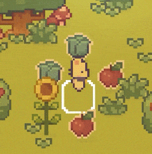

## 项目概述

项目名称：猫咪农场（KittyFarm）

团队名称：海底星辰

团队成员：胡建波

### 游戏介绍

猫咪农场是一款2D模拟经营游戏，具有可爱的像素美术风格。

在游戏中你将化身为一只小猫咪，为了逃离尘世的喧嚣，独自前往荒芜的小岛上开辟一片属于自己的天地。

岛上似乎有其他人生活过的痕迹——一间不大的别墅、两块荒废的农田和可交易的无人商店，感觉一切都是为你准备好的。

“接下来就可以自由地种菜了！”你欢喜地说道。

### 开发工具相关

团结引擎：1.0.4

Rider：2023.3.3

OpenHarmony版本：4.0

## 游戏说明

### 主要玩法

使用锄头为耕地松土，撒上在商店购买的种子，静待作物成熟并收获，采摘果树、卖出作物获得金币，如此循环。

### 详细功能

#### 1.背包与物品系统

背包中最多存放9种不同的物品，拖动物品可以交换位置。

接触到掉落在地图上的物品时，可将其拾取并放入背包中。

选中物品后，点击地图可以进行使用。选中锄头点击耕地可以松土，选中种子点击松过土的耕地可以种植，选中收获的作物或资源可以将其丢弃。

#### 2.作物种植系统

种下种子后，作物会随时间不断生长。每一种作物均有多个阶段，成熟所花费的时间各不相同。

作物成熟后，点击可进行收获，收获数量在配置的范围内随机。

作物在生长时，点击可查看其生长的具体信息。

#### 3.资源重复采集

地图上有各种资源可点击进行收集，如苹果树、梨树等。

资源采集后过一段时间会重新生成。

#### 4.商店

在商店窗口中，可以查看商品的详细信息，输入购买数量后点击购买。

将背包物品拖入商店，可将物品卖出，获得金币。

#### 5.环境交互

当小猫站在树木和巨大的石头后面时，物体的不透明度会降低。

#### 6.昼夜光照变化

游戏时间与现实时间同步，场景中的光照会随时间不断变化，实现昼夜更替的效果。

#### 7.音乐与音效

游戏包含一首背景音乐，和多种音效，可以在设置窗口中进行开关和音量调节。

### 美术与音乐

本项目使用到的所有美术资源来自Cup Nooble，本人已购买获得许可。

1. [Sprout Lands Asset Pack](https://cupnooble.itch.io/sprout-lands-asset-pack)
2. [Sprout Lands UI Pack](https://cupnooble.itch.io/sprout-lands-ui-pack)

背景音乐名为 Keep Smiling，来自[FITTYSOUNDS](https://www.fiftysounds.com/)。

音效资源来自Unity Asset Store，名为[FREE Casual Game SFX Pack](https://assetstore.unity.com/packages/audio/sound-fx/free-casual-game-sfx-pack-54116)。

## 界面与操作说明

### 开始场景

首先会显示加载界面，等待开始场景异步加载，进度条满后关闭加载界面，显示开始界面。

#### 开始界面

- 开始按钮位于屏幕中下方，点击即可进入游戏地图场景。
- 右上角从上至下依次为设置按钮和退出按钮。点击设置按钮会打开设置窗口；点击退出按钮即可退出游戏。

#### 设置窗口

设置窗口的主要功能是调节背景音乐和游戏音效的音量。

- 拖动滑动条可以调节音量。
- 点击右侧开关样式的按钮可以开启或关闭音乐和音效。

### 地图场景

首次进入地图时，会自动播放开场动画，动画结束后才会显示游戏界面。在显示3条对话框内容之后，就可以操纵小猫进行游戏了。

与游戏场景交互的通用方式：

1. 操控小猫移动到场景物体的位置。
2. 点击场景物体（目前只实现了果树、作物和地图网格的点击逻辑）。

#### 游戏界面

- 左上角显示小猫的头像和当前拥有的金币数量。
- 顶部木板框内显示的是当前时间，与现实时间同步。
- 右上角有三个按钮，从上至下依次为设置按钮、返回按钮和商店按钮。点击设置按钮会打开设置窗口，点击返回按钮可以返回开始场景，点击商店按钮会打开商店窗口。
- 底部显示的是背包物品信息，共9个格子。当格子中有物品时才可以被选中和拖动，拖动格子可以交换物品位置。
- 点击地图上的作物后，在右侧会弹出作物信息面板，显示作物名称、生长时间等信息。
- 左下方猫抓图标是用于控制小猫移动的摇杆，拖动即可移动。

#### 商店窗口

- 左侧是商品列表，若商品数量有限，则在右下角显示剩余数量，若无限则不显示数量。
- 点击商品后，右侧会显示商品的信息，数量的编辑框，以及购买/卖出按钮。
- 商店默认为“买”模式，即对商店内商品进行购买。
- 将背包物品拖入商店窗口中后，变为“卖”模式，可以将拖入的背包物品卖出。

#### 获得物品界面

当在商店成功购买商品或收获农作物时，会弹出该界面，主要显示物品名称和数量，点击任意处即可关闭。

#### 提示消息

当某些操作无法实现，如使用锄头重复松土、在松土之前播种等等，游戏会在屏幕中央显示对应的提示消息，并且过一会后自动消失。

#### 气泡框

点击背包物品后，在小猫右侧会弹出气泡框，显示物品名称。

## 应用安装包

使用团结引擎导出的OpenHarmony安装包见根目录文件`kittyfarm.hap`。

## 游戏演示

[演示视频传送门](https://www.bilibili.com/video/BV1dy411Y796/)
